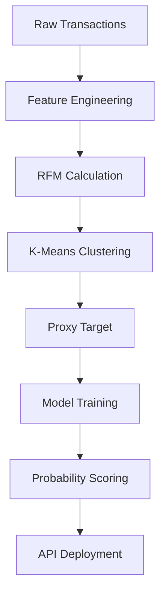

# Credit Risk Probability Model for Alternative Data

## Table of Contents
- [Credit Risk Probability Model for Alternative Data](#credit-risk-probability-model-for-alternative-data)
  - [Table of Contents](#table-of-contents)
  - [Credit Scoring Business Understanding](#credit-scoring-business-understanding)
    - [1. Basel II Accord's Influence on Model Requirements](#1-basel-ii-accords-influence-on-model-requirements)
    - [2. Proxy Variable Necessity and Business Risks](#2-proxy-variable-necessity-and-business-risks)
    - [3. Model Selection Trade-offs in Regulated Finance](#3-model-selection-trade-offs-in-regulated-finance)
  - [Project Overview](#project-overview)
  - [Project Structure](#project-structure)
  - [Technical Approach](#technical-approach)
  - [Getting Started](#getting-started)
- [Clone repository:](#clone-repository)
- [Install dependencies:](#install-dependencies)
- [Run EDA notebook:](#run-eda-notebook)

## Credit Scoring Business Understanding
*(Task 1 Deliverable)*

### 1. Basel II Accord's Influence on Model Requirements
The Basel II Capital Accord mandates that financial institutions:
- Quantify credit risk exposure through rigorous measurement
- Maintain capital reserves proportional to risk exposure
- Implement comprehensive validation frameworks

**This directly requires:**
- **Interpretability**: Regulators must validate how risk calculations are derived
- **Documentation**: Full audit trail of data sources, transformations, and decision logic
- **Risk Sensitivity**: Models must accurately differentiate risk levels
- **Validation**: Regular back-testing and sensitivity analysis

As stated in the [HKMA guidance](https://www.hkma.gov.hk/media/eng/doc/key-functions/financial-infrastructure/alternative_credit_scoring.pdf):
> "Models must be conceptually sound and empirically validated with clear documentation of methodologies and outcomes."

### 2. Proxy Variable Necessity and Business Risks
**Why a proxy is essential:**
- No historical default labels exist for new e-commerce customers
- Traditional credit indicators are unavailable in transaction data
- RFM behavior provides the closest analog to credit engagement patterns
- Enables immediate scoring without credit history (per [World Bank guidelines](https://thedocs.worldbank.org/en/doc/935891585869698451-0130022020/original/CREDITSCORINGAPPROACHESGUIDELINESFINALWEB.pdf))

**Potential business risks:**
| Risk Type | Description | Mitigation Strategy |
|-----------|-------------|---------------------|
| Misalignment Risk | E-commerce behavior ≠ loan repayment behavior | Validate clusters with repayment data when available |
| Cluster Validity | K-means groups may not reflect true risk | Use silhouette scoring and domain expert review |
| Threshold Sensitivity | Small RFM changes alter classifications | Implement buffer zones between risk segments |
| Regulatory Challenge | Proxy justification may face scrutiny | Document rationale using [academic research](https://www3.stat.sinica.edu.tw/statistica/oldpdf/A28n535.pdf) |
| Edge Case Handling | New customer types might not fit clusters | Implement human review for marginal cases |

### 3. Model Selection Trade-offs in Regulated Finance
| Factor | Simple Model (Logistic Regression w/WoE) | Complex Model (Gradient Boosting) |
|--------|------------------------------------------|-----------------------------------|
| **Interpretability** | ✅ High (direct coefficient analysis) | ❌ Requires SHAP/LIME explanations |
| **Regulatory Compliance** | ✅ Easier approval | ⚠️ Extensive validation needed |
| **Performance** | ⚠️ Limited to linear relationships | ✅ Better for complex patterns |
| **Implementation** | ✅ Faster development | ⚠️ Longer training/tuning |
| **Feature Engineering** | ❌ Manual WoE transformation | ✅ Automatic feature interaction |
| **Auditability** | ✅ Clear decision trails | ⚠️ Harder to trace decisions |

**Recommendation**: 
Use Logistic Regression with WoE for initial deployment to satisfy regulatory requirements, while running Gradient Boosting in shadow mode. For critical decisions, implement hybrid scoring with human oversight for high-risk cases.

## Project Overview
End-to-end implementation of credit risk probability model for Bati Bank's buy-now-pay-later service. Transforms e-commerce transaction data into predictive risk signals using RFM behavioral patterns.

**Key Components**:
1. Proxy risk variable creation
2. Feature engineering pipeline
3. Risk probability model
4. Credit score conversion
5. API deployment

## Project Structure
credit-risk-model/
├── .github/workflows/ # CI/CD pipeline
├── data/ # Raw/processed data
├── notebooks/ # EDA notebooks
├── src/ # Core code
│ ├── data_processing.py # Feature engineering
│ ├── train.py # Model training
│ └── api/ # FastAPI implementation
├── tests/ # Unit tests
├── requirements.txt # Dependencies
└── README.md # This document


## Technical Approach


## Getting Started
# Clone repository:

```bash
git clone https://github.com/bati-bank/credit-risk-model.git
```
# Install dependencies:

```bash
pip install -r requirements.txt
```
# Run EDA notebook:

```bash
jupyter notebook notebooks/1.0-eda.ipynb
```