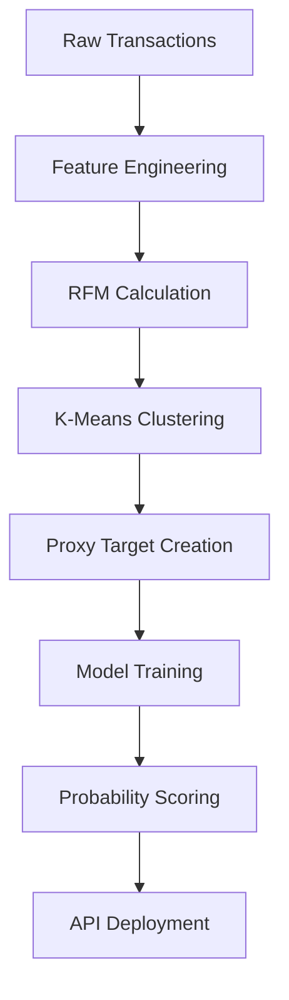

# Credit Risk Probability Model Using Alternative Data

## 📌 Table of Contents

- [Credit Risk Probability Model Using Alternative Data](#credit-risk-probability-model-using-alternative-data)
  - [📌 Table of Contents](#-table-of-contents)
  - [📘 Business Context](#-business-context)
    - [Credit Scoring Business Understanding](#credit-scoring-business-understanding)
      - [Data Inputs and Model Types](#data-inputs-and-model-types)
      - [Risk Measurement in Regulatory Context](#risk-measurement-in-regulatory-context)
      - [Ethical and Operational Considerations](#ethical-and-operational-considerations)
    - [1. Basel II: Emphasis on Model Transparency](#1-basel-ii-emphasis-on-model-transparency)
    - [2. Proxy Variables: Necessity and Risk](#2-proxy-variables-necessity-and-risk)
      - [Common Risks of Proxy Variables](#common-risks-of-proxy-variables)
    - [3. Model Trade-offs: Simplicity vs. Complexity](#3-model-trade-offs-simplicity-vs-complexity)
    - [Questions and Answers](#questions-and-answers)
  - [🚀 Project Overview](#-project-overview)
    - [Key Steps:](#key-steps)
  - [📁 Project Structure](#-project-structure)
  - [🧠 Technical Approach](#-technical-approach)
  - [🛠 Getting Started](#-getting-started)
    - [1. Clone the Repository](#1-clone-the-repository)
    - [2. Install Dependencies](#2-install-dependencies)
    - [3. Run the EDA Notebook](#3-run-the-eda-notebook)
  - [📚 References](#-references)
  - [🛡️ Regulatory Considerations](#️-regulatory-considerations)
  - [🧭 Model Selection Strategy](#-model-selection-strategy)
  - [📬 Contact](#-contact)

---

## 📘 Business Context

### Credit Scoring Business Understanding

Credit scoring is a statistical technique used by financial institutions to estimate the likelihood that a borrower will default. It informs lending decisions, interest rate settings, and portfolio risk management.

Key motivations include:

- **Risk-based pricing:** Adjusting loan terms based on risk profiles.
- **Capital optimization:** Allocating reserves efficiently using PD, LGD, and EAD metrics.
- **Regulatory compliance:** Meeting supervisory requirements (e.g., Basel II/III).
- **Operational scalability:** Automating approvals in high-volume environments.

Modern credit scoring increasingly uses **alternative data**—such as mobile money, utility payments, and e-commerce behavior—to evaluate underbanked populations, promoting **financial inclusion** (World Bank, 2020).

#### Data Inputs and Model Types

Traditional inputs:
- Repayment history
- Credit utilization
- Credit age
- Account mix
- Recent credit inquiries

Alternative inputs:
- RFM metrics (Recency, Frequency, Monetary) from transactions
- Behavioral features (e.g., login frequency, abandoned carts)
- Utility/telco data

**Model types** range from:
- **Supervised models:** Logistic Regression, Decision Trees, XGBoost
- **Unsupervised models:** K-Means, DBSCAN (for segmentation and proxy labeling)

These models often combine structured credit variables with behavioral data, as shown in the HKMA (2019) framework.

#### Risk Measurement in Regulatory Context

Basel II's IRB approach requires accurate estimation of:
- **PD (Probability of Default)**
- **LGD (Loss Given Default)**
- **EAD (Exposure at Default)**

These drive capital adequacy requirements. As Yeh & Lien (2018) highlight, while ML models may enhance predictive power, regulatory approval depends on **explainability, fairness, and documentation**.

#### Ethical and Operational Considerations

Credit scoring also faces non-technical risks:
- **Bias/Fairness:** Risk of disparate impact on protected groups.
- **Privacy:** Alternative data must comply with local laws.
- **Explainability:** Complex models must be auditable (SHAP, LIME).

Institutions should perform **bias audits**, build **interpretable pipelines**, and ensure **regulatory alignment** (Risk-Officer.com).

> ⚖️ **Summary**: Credit scoring is not just a modeling challenge but a regulatory, ethical, and strategic priority. Models must be accurate, fair, transparent, and compliant—especially when using alternative data sources.

---

### 1. Basel II: Emphasis on Model Transparency

Basel II introduces a three-pillar framework:

- **Pillar 1:** Capital requirements based on credit risk
- **Pillar 2:** Supervisory review of internal models
- **Pillar 3:** Market discipline via transparency

Implications:
- Favor interpretable models like logistic regression.
- Avoid "black-box" solutions without clear traceability.
- Regulators require full documentation and auditability.

---

### 2. Proxy Variables: Necessity and Risk

In alternative data contexts, default labels are rare. We simulate risk using **proxy variables** like:

- ≥90 Days Past Due
- Account Write-Offs
- Missed Payments (60+ days)

#### Common Risks of Proxy Variables

| Risk Type               | Description                                       | Impact                                    |
|------------------------|---------------------------------------------------|-------------------------------------------|
| False Positives         | Good borrowers misclassified                      | Lost revenue                              |
| False Negatives         | Risky borrowers overlooked                        | Unexpected defaults                        |
| Regulatory Misalignment | Proxy doesn’t align with regulatory standards     | Model rejection or remediation required    |

> 📝 Proxies must be transparent, justified, and statistically sound.

---

### 3. Model Trade-offs: Simplicity vs. Complexity

| Criteria                | Simple Models (Logistic, WoE)  | Complex Models (XGBoost, NN)            |
|------------------------|----------------------------------|------------------------------------------|
| Interpretability       | ✅ High                         | ⚠️ Requires SHAP/LIME                   |
| Regulatory Compliance  | ✅ Strong                       | ⚠️ Needs extensive validation           |
| Accuracy               | ⚠️ Moderate                     | ✅ High                                  |
| Development Cost       | ✅ Low                          | ⚠️ High                                  |
| Operational Risk       | ✅ Low                          | ⚠️ Difficult to monitor/debug            |

> 🔄 Recommendation: Use **interpretable models for deployment**, and **ML models as challenger models** or for feature enrichment.

---

### Questions and Answers

**Q1:** *Why is interpretability critical under Basel II?*

Basel II requires banks to justify risk estimates like PD, LGD, and EAD. Transparent models allow regulators to validate assumptions, increasing trust and reducing capital buffers.

**Q2:** *Why do we use proxy variables, and what are the risks?*

In the absence of default labels, proxy variables (e.g., high RFM risk segments) simulate borrower risk. If proxies are misaligned, the model may be biased or rejected by regulators.

**Q3:** *What are the trade-offs between simple and complex models?*

Simple models support compliance and transparency. Complex models may offer better accuracy but require justification tools (e.g., SHAP) and risk increased scrutiny.

---

## 🚀 Project Overview

This repository provides a **credit risk probability model** for Bati Bank’s Buy-Now-Pay-Later (BNPL) service using **alternative data**.

It leverages **RFM segmentation**, **clustering**, and **supervised modeling** to estimate risk and deploy scores via API.

### Key Steps:

1. Generate proxy target using RFM segmentation
2. Feature engineering from transaction data
3. Train supervised model (e.g., logistic regression or XGBoost)
4. Convert probabilities into credit scores
5. Expose scoring system via FastAPI

---
## 📁 Project Structure

```
credit-risk-model/
├── .github/workflows/      # CI/CD pipelines
├── data/                   # Raw and processed datasets
├── notebooks/              # EDA and model development notebooks
├── src/                    # Core source code
│   ├── data_processing.py  # Feature engineering pipeline
│   ├── train.py            # Model training logic
│   └── api/                # FastAPI scoring API
├── tests/                  # Unit tests for data & model logic
├── requirements.txt        # Project dependencies
└── README.md               # Documentation (you’re here!)
```

---

## 🧠 Technical Approach



---

## 🛠 Getting Started

### 1. Clone the Repository

```bash
git clone https://github.com/bati-bank/credit-risk-model.git
cd credit-risk-model
```

### 2. Install Dependencies

```bash
pip install -r requirements.txt
```

### 3. Run the EDA Notebook

```bash
jupyter notebook notebooks/1.0-eda.ipynb
```

---

## 📚 References

1. Yeh, I.-C., & Lien, C.-H. (2018). [Statistica Sinica – Credit Card Default Prediction](https://www3.stat.sinica.edu.tw/statistica/oldpdf/A28n535.pdf)
2. Hong Kong Monetary Authority (HKMA). (2019). [Alternative Credit Scoring Using Non-traditional Data](https://www.hkma.gov.hk/media/eng/doc/key-functions/financial-infrastructure/alternative_credit_scoring.pdf)
3. The World Bank. (2020). [Credit Scoring Approaches Guidelines](https://thedocs.worldbank.org/en/doc/935891585869698451-0130022020/original/CREDITSCORINGAPPROACHESGUIDELINESFINALWEB.pdf)
4. Satti, A. (2020). [Towards Data Science – Credit Risk Models](https://towardsdatascience.com/how-to-develop-a-credit-risk-model-and-scorecard-91335fc01f03)
5. Corporate Finance Institute. [Credit Risk Overview](https://corporatefinanceinstitute.com/resources/commercial-lending/credit-risk/)
6. Risk-Officer. [Credit Risk Models and Compliance](https://www.risk-officer.com/Credit_Risk.htm)

---

## 🛡️ Regulatory Considerations

- All transformations must be explainable and documented.
- Use interpretable models when possible.
- Conduct backtesting and sensitivity analysis regularly.
- Proxy variables must be well-justified and traceable to regulatory standards.

---

## 🧭 Model Selection Strategy

| Factor                | Logistic Regression (WoE) | Gradient Boosting     |
|----------------------|---------------------------|------------------------|
| Interpretability     | ✅ High                    | ⚠️ Requires SHAP       |
| Compliance           | ✅ Strong                  | ⚠️ Moderate            |
| Predictive Accuracy  | ⚠️ Moderate                | ✅ High                |
| Implementation Speed | ✅ Fast                    | ⚠️ Slower              |
| Auditability         | ✅ Clear                   | ⚠️ Needs documentation |

> 🔄 *Hybrid approach recommended: Use interpretable models for deployment and ML models for feature engineering or challenger testing.*

---

## 📬 Contact

For questions or contributions, please open an issue or reach out via [GitHub Discussions](https://github.com/EstiphanosH/Credit-Risk-Probability-Model-for-Alternative-Data/discussions).
