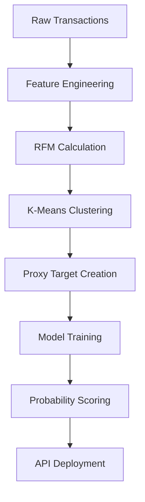

# Credit Risk Probability Model Using Alternative Alternative Data

## 📌 Table of Contents

- [Credit Risk Probability Model Using Alternative Alternative Data](#credit-risk-probability-model-using-alternative-alternative-data)
  - [📌 Table of Contents](#-table-of-contents)
  - [📘 Business Context](#-business-context)
    - [Credit Scoring in Regulated Financial Services](#credit-scoring-in-regulated-financial-services)
    - [1. Basel II: Emphasis on Model Transparency](#1-basel-ii-emphasis-on-model-transparency)
    - [2. Proxy Variables: Necessity and Risk](#2-proxy-variables-necessity-and-risk)
      - [Common Risks of Proxy Variables](#common-risks-of-proxy-variables)
    - [3. Model Trade-offs: Simplicity vs. Complexity](#3-model-trade-offs-simplicity-vs-complexity)
      - [Comparison: Interpretable vs. Complex Models](#comparison-interpretable-vs-complex-models)
  - [🚀 Project Overview](#-project-overview)
    - [Key Steps:](#key-steps)
  - [📁 Project Structure](#-project-structure)
  - [🧠 Technical Approach](#-technical-approach)
  - [🛠 Getting Started](#-getting-started)
    - [1. Clone the Repository](#1-clone-the-repository)
    - [2. Install Dependencies](#2-install-dependencies)
    - [3. Run the EDA Notebook](#3-run-the-eda-notebook)
  - [📚 References](#-references)
  - [🛡️ Regulatory Considerations](#️-regulatory-considerations)
  - [🧭 Model Selection Strategy](#-model-selection-strategy)
  - [📬 Contact](#-contact)

---

## 📘 Business Context

### Credit Scoring in Regulated Financial Services

Credit scoring models estimate the likelihood that a borrower will default. Financial institutions depend on these models to:

- Manage **credit risk**
- Optimize **capital allocation**
- Comply with **regulatory standards** (e.g., Basel II Accord)

In regulated environments, model **interpretability** and **proxy variable design** are critical.

---

### 1. Basel II: Emphasis on Model Transparency

Basel II introduced a three-pillar framework:

- **Pillar 1: Minimum Capital Requirements** – Capital reserves must reflect risk.
- **Pillar 2: Supervisory Review** – Internal models undergo rigorous regulatory scrutiny.
- **Pillar 3: Market Discipline** – Transparent disclosure of risk metrics is mandatory.

**Implications:**

- Models must be explainable and traceable.
- Opaque or undocumented models increase regulatory risk and required capital buffers.
- Institutions favor **interpretable** approaches like logistic regression over black-box models.

> 🔍 *Regulatory non-compliance may result in delayed model approval, operational penalties, or increased capital requirements.*

---

### 2. Proxy Variables: Necessity and Risk

In many scenarios, especially when using **alternative data** (e.g., e-commerce transactions), **default labels are unavailable**. As a result, **proxy variables** are used to approximate risk, such as:

- ≥90 Days Past Due
- Account Write-Offs
- 60-Day Missed Payments

Poor proxy design can introduce **bias** and **regulatory misalignment**.

#### Common Risks of Proxy Variables

| Risk Type               | Description                                                  | Impact                                                   |
|------------------------|--------------------------------------------------------------|----------------------------------------------------------|
| False Positives         | Overly strict proxies flag non-defaulters as risky           | Revenue loss due to rejecting good borrowers             |
| False Negatives         | Weak proxies fail to identify true defaulters                | Unexpected defaults and credit losses                    |
| Regulatory Misalignment | Proxy deviates from 90+ days delinquency standard            | Failed validation or regulatory pushback                 |

> 📝 *Example: Ignoring sudden income loss could cause underestimation of risk during economic downturns.*

---

### 3. Model Trade-offs: Simplicity vs. Complexity

#### Comparison: Interpretable vs. Complex Models

| Criteria                | Simple Models (Logistic Regression, WoE) | Complex Models (Gradient Boosting, Neural Nets)       |
|------------------------|------------------------------------------|--------------------------------------------------------|
| Interpretability       | High                                     | Low (requires SHAP, LIME for explanation)             |
| Regulatory Compliance  | Strong                                   | Limited (requires extensive documentation)            |
| Predictive Accuracy    | Moderate (AUC ~0.70–0.85)                 | High (AUC >0.85 with nonlinear features)              |
| Development Cost       | Low                                      | High                                                   |
| Operational Risk       | Low                                      | Higher (harder to monitor, retrain, and debug)         |

> ✅ *Recommendation: Use simple models for compliance, augment with ML for performance benchmarking.*

---

## 🚀 Project Overview

This repository contains a **credit risk probability model** for **Bati Bank’s Buy-Now-Pay-Later** product, built using **alternative e-commerce data**.

The pipeline uses **RFM analysis** and **unsupervised clustering** to define proxy targets, followed by supervised learning to estimate default risk.

### Key Steps:

1. Generate proxy target from RFM-based customer segments
2. Engineer features from raw transaction data
3. Train a probability-of-default model
4. Map probabilities to credit scores
5. Deploy the scoring system via an API

---

## 📁 Project Structure

```
credit-risk-model/
├── .github/workflows/      # CI/CD pipelines
├── data/                   # Raw and processed datasets
├── notebooks/              # EDA and model development notebooks
├── src/                    # Core source code
│   ├── data_processing.py  # Feature engineering pipeline
│   ├── train.py            # Model training logic
│   └── api/                # FastAPI scoring API
├── tests/                  # Unit tests for data & model logic
├── requirements.txt        # Project dependencies
└── README.md               # Documentation (you’re here!)
```

---

## 🧠 Technical Approach



---

## 🛠 Getting Started

### 1. Clone the Repository

```bash
git clone https://github.com/bati-bank/credit-risk-model.git
cd credit-risk-model
```

### 2. Install Dependencies

```bash
pip install -r requirements.txt
```

### 3. Run the EDA Notebook

```bash
jupyter notebook notebooks/1.0-eda.ipynb
```

---

## 📚 References

1. Yeh, I.-C., & Lien, C.-H. (2018). [Statistica Sinica – Credit Card Default Prediction](https://www3.stat.sinica.edu.tw/statistica/oldpdf/A28n535.pdf)
2. Hong Kong Monetary Authority (HKMA). (2019). [Alternative Credit Scoring Using Non-traditional Data](https://www.hkma.gov.hk/media/eng/doc/key-functions/financial-infrastructure/alternative_credit_scoring.pdf)
3. The World Bank. (2020). [Credit Scoring Approaches Guidelines](https://thedocs.worldbank.org/en/doc/935891585869698451-0130022020/original/CREDITSCORINGAPPROACHESGUIDELINESFINALWEB.pdf)
4. Satti, A. (2020). [Towards Data Science – Credit Risk Models](https://towardsdatascience.com/how-to-develop-a-credit-risk-model-and-scorecard-91335fc01f03)
5. Corporate Finance Institute. [Credit Risk Overview](https://corporatefinanceinstitute.com/resources/commercial-lending/credit-risk/)
6. Risk-Officer. [Credit Risk Models and Compliance](https://www.risk-officer.com/Credit_Risk.htm)

---

## 🛡️ Regulatory Considerations

- All transformations must be explainable and documented.
- Use interpretable models when possible.
- Conduct backtesting and sensitivity analysis regularly.
- Proxy variables must be well-justified and traceable to regulatory standards.

---

## 🧭 Model Selection Strategy

| Factor                | Logistic Regression (WoE) | Gradient Boosting     |
|----------------------|---------------------------|------------------------|
| Interpretability     | ✅ High                    | ⚠️ Requires SHAP       |
| Compliance           | ✅ Strong                  | ⚠️ Moderate            |
| Predictive Accuracy  | ⚠️ Moderate                | ✅ High                |
| Implementation Speed | ✅ Fast                    | ⚠️ Slower              |
| Auditability         | ✅ Clear                   | ⚠️ Needs documentation |

> 🔄 *Hybrid approach recommended: Use interpretable models for deployment and ML models for feature engineering or challenger testing.*

---

## 📬 Contact

For questions or contributions, please open an issue or reach out via [GitHub Discussions](https://github.com/EstiphanosH/Credit-Risk-Probability-Model-for-Alternative-Data/discussions).
